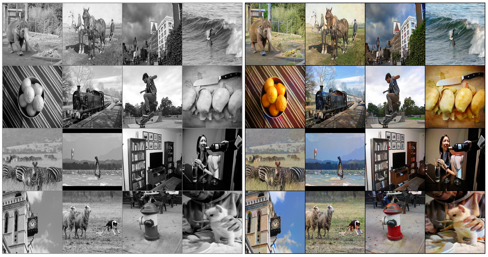
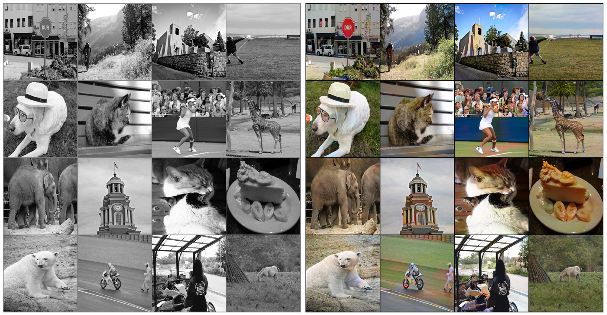
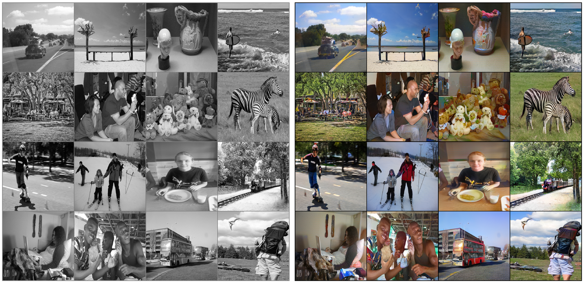
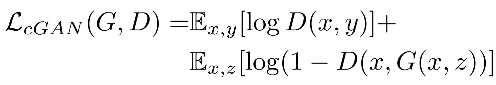
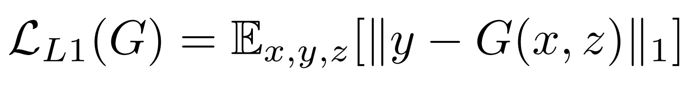
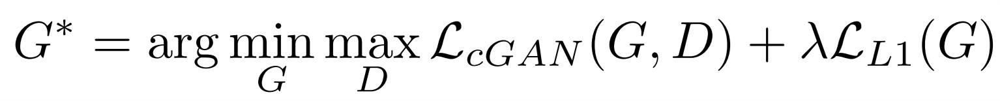
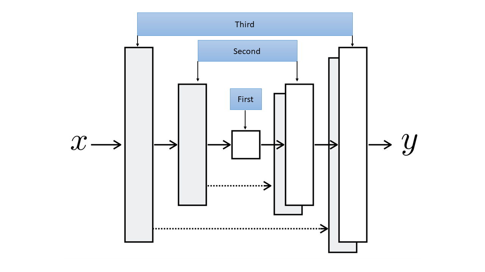
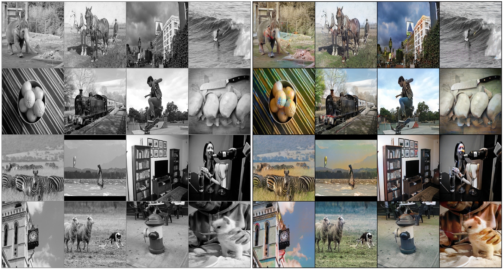
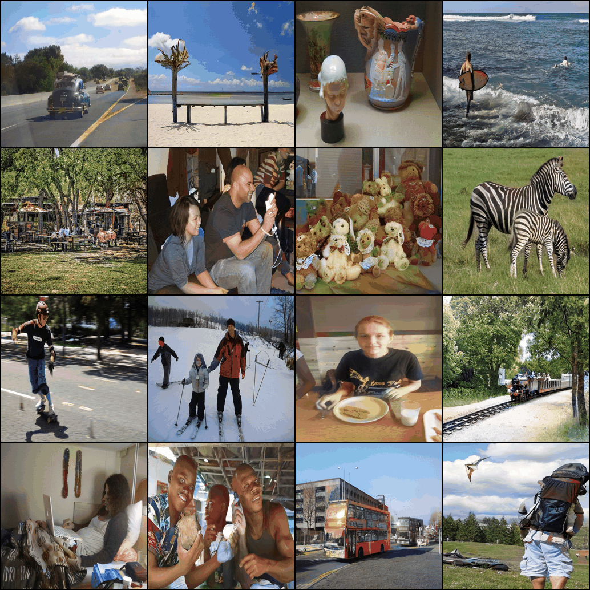

# Image Colorization using Deep Learning Models

**I have successfully completed my project in the second semester of my MTech program, with guidance from my advisor. Throughout its development, I extensively utilized numerous resources, including research papers, to enhance my understanding of various concepts in deep learning.  This project has greatly contributed to my understanding of various concepts in deep learning, significantly aiding in my learning process. To quickly review the project, you can directly refer to the "Project_Report.pdf" file, which contains all the mentioned results. Enjoy!!**


## Final model's output using U-Net and conditional GAN


Left: Input black & white images from test set | Right: the colorized outputs by the final model of this tutorial

---

Left: Input black & white images from test set | Right: the colorized outputs by the final model of this tutorial

---

Left: Input black & white images from test set | Right: the colorized outputs by the final model of this tutorial

---

Turning black and white images into colorized versions has become an exciting application of advanced machine learning. In the past, this process relied heavily on human effort and tedious manual coding. However, thanks to the incredible capabilities of artificial intelligence and advanced machine learning techniques, we can now effortlessly complete the entire process from start to finish. Some might assume that training a model from scratch for this task requires massive amounts of data and extensive training periods. However, my recent work over the past few weeks challenges this belief.

During this timeframe, I conducted experiments using different model structures, loss functions, training methods, and more, in order to discover the best approach. By harnessing the latest advancements in deep learning, I successfully devised an efficient strategy to train a model for colorization. Surprisingly, I achieved this using a relatively small dataset and significantly reduced training times.

## Introduction to colorization problem

### RGB vs L\*a\*b

You may already know that when we open an image, it is displayed as a three-dimensional array with dimensions representing the height, width, and color. The last dimension of the array corresponds to the color information of the image. Generally, the colors are represented in the RGB color space, where each pixel is described by three numbers indicating the amount of Red, Green, and Blue present. In the given image, you can see that the left side of the "main image" (the image on the far left) appears to have a blue tone. As a result, in the blue color channel of the image, this specific area has higher values, which makes it appear darker.


In the Lab color space, every pixel is still described using three values. Nevertheless, the meaning of these values is distinct. The initial channel, L, carries the information about the brightness of each pixel. When viewed on its own (as shown in the second picture in the row below), this channel looks like a grayscale image. Conversely, the a and b channels hold the data about the amount of green-red and yellow-blue tones, respectively, for each pixel. The next image illustrates the distinct channels of the Lab color space.


In order to teach a colorization model, our usual approach involves supplying it with a black-and-white image and expecting it to produce a vibrant, colorful output. When employing the Lab color space, we can input the L channel (which represents the grayscale image) into the model and assign it the task of predicting the remaining two channels (*a and *b). Once we have obtained these predictions, we combine all three channels to reconstruct the final, richly colored image.

However, if we were to directly use the RGB color space, we would first have to convert the image to grayscale, pass the grayscale version to the model, and hope that the model accurately predicts all three color channels. This proves to be a more difficult and unreliable undertaking due to the significantly larger number of possible combinations when predicting three values compared to just two.

Our plan involves constructing a GAN (specifically, a conditional GAN) and incorporating an additional loss function known as L1 loss. Let's begin by working on the GAN.

### A deeper dive into GAN world

In a Generative Adversarial Network (GAN), we have two main components: the generator and the discriminator. These components work together collaboratively to tackle a problem. Specifically, our generator takes a black-and-white image (a single-channel image) as input and produces a two-channel image, with one channel for *a and another for *b.

The discriminator, on the other hand, evaluates the authenticity of the two generated channels by combining them with the input black-and-white image. Its task is to determine whether the resulting three-channel image is genuine or artificially generated. To ensure the discriminator's effectiveness, it must also be exposed to real images (three-channel images in the Lab color space) that were not created by the generator. This helps the discriminator learn to differentiate between real and fake images.

Now, let's focus on the concept of "condition" we mentioned earlier. The grayscale image that both the generator and discriminator observe acts as a guiding condition for both models within our GAN. We anticipate that both models take this condition into account while performing their respective tasks.

To delve into the mathematical aspect, let's represent the grayscale image as x, the input noise for the generator as z, and the desired two-channel output as y (which can also represent the two color channels of a real image). Additionally, we denote G as the generator model and D as the discriminator. Accordingly, the loss function for our conditional GAN can be expressed as follows:



Notice that _**x**_ is given to both models which is the condition we introduce two both players of this game. Actually, we are not going to feed a "n" dimensional vector of random noise to the generator as you might expect but the noise is introduced in the form of dropout layers (there is something cool about it which you will read in the last section of the article) in the generator architecture.

### Loss function we optimize

The previous loss function contributes to generating visually appealing and realistic colorful images. However, in order to provide additional support to the models and incorporate some guidance in our objective, we incorporate the L1 Loss (also known as mean absolute error) between the predicted colors and the actual colors.



When only L1 loss is employed, the model continues to acquire the ability to add color to the images. However, it tends to be cautious and frequently selects colors such as "gray" or "brown" when it is uncertain about the optimal choice. This behavior is motivated by the desire to minimize the L1 loss by taking the average and utilizing these colors, resulting in a similar blurring effect observed in L1 or L2 loss in the super resolution task. Furthermore, L1 loss is favored over L2 loss (or mean squared error) because it mitigates the tendency to generate images with a grayish appearance. Therefore, our combined loss function will be as follows:



where _**λ**_ is a coefficient to balance the contribution of the two losses to the final loss (of course the discriminator loss does not involve the L1 loss).

## 1 - Implementing the paper - Our Baseline

### 1.1- Loading Image Paths

We are using only 8,000 images from COCO dataset for training . 


```python
import os
import glob
import time
import numpy as np
from PIL import Image
from pathlib import Path
from tqdm.notebook import tqdm
import matplotlib.pyplot as plt
from skimage.color import rgb2lab, lab2rgb
Path.ls = lambda x: list(x.iterdir())

import torch
from torch import nn, optim
from torchvision import transforms
from torchvision.utils import make_grid
from torch.utils.data import Dataset, DataLoader
device = torch.device("cuda" if torch.cuda.is_available() else "cpu")
```


```python
paths = glob.glob("/datasets/coco/*.jpg") # Your path for your dataset
np.random.seed(123)
paths_subset = np.random.choice(paths, 10_000, replace=False) # choosing 1000 images randomly
rand_idxs = np.random.permutation(10_000)
train_idxs = rand_idxs[:8000] # choosing the first 8000 as training set
val_idxs = rand_idxs[8000:] # choosing last 2000 as validation set
train_paths = paths_subset[train_idxs]
val_paths = paths_subset[val_idxs]
print(len(train_paths), len(val_paths))
```


```python
_, axes = plt.subplots(4, 4, figsize=(10, 10))
for ax, img_path in zip(axes.flatten(), train_paths):
    ax.imshow(Image.open(img_path))
    ax.axis("off")
```

### 1.2- Making Datasets and DataLoaders

```python
SIZE = 256
class ColorizationDataset(Dataset):
    def __init__(self, paths, split='train'):
        if split == 'train':
            self.transforms = transforms.Compose([
                transforms.Resize((SIZE, SIZE),  Image.BICUBIC),
                transforms.RandomHorizontalFlip(), # A little data augmentation!
            ])
        elif split == 'val':
            self.transforms = transforms.Resize((SIZE, SIZE),  Image.BICUBIC)
        
        self.split = split
        self.size = SIZE
        self.paths = paths
    
    def __getitem__(self, idx):
        img = Image.open(self.paths[idx]).convert("RGB")
        img = self.transforms(img)
        img = np.array(img)
        img_lab = rgb2lab(img).astype("float32") # Converting RGB to L*a*b
        img_lab = transforms.ToTensor()(img_lab)
        L = img_lab[[0], ...] / 50. - 1. # Between -1 and 1
        ab = img_lab[[1, 2], ...] / 110. # Between -1 and 1
        
        return {'L': L, 'ab': ab}
    
    def __len__(self):
        return len(self.paths)

def make_dataloaders(batch_size=16, n_workers=4, pin_memory=True, **kwargs): # A handy function to make our dataloaders
    dataset = ColorizationDataset(**kwargs)
    dataloader = DataLoader(dataset, batch_size=batch_size, num_workers=n_workers,
                            pin_memory=pin_memory)
    return dataloader
```


```python
train_dl = make_dataloaders(paths=train_paths, split='train')
val_dl = make_dataloaders(paths=val_paths, split='val')

data = next(iter(train_dl))
Ls, abs_ = data['L'], data['ab']
print(Ls.shape, abs_.shape)
print(len(train_dl), len(val_dl))
```

### 1.3- Generator

This code uses a U-Net as the generator for our GAN. The key concept to grasp is that it constructs the U-Net by starting from the middle section (the bottom of the U shape) and progressively adds down-sampling and up-sampling modules on the left and right sides of that central module, respectively, with each iteration until it reaches the input and output modules. Take a look at the image below, which was created using one of the images in the article, to get a clearer understanding of the code's functionality.:



The blue rectangles indicate the sequence in which the associated modules are constructed using the code. The U-Net we are constructing contains a greater number of layers than what is shown in this image, but the image provides a sufficient understanding. Additionally, observe in the code that we are descending through 8 layers. Therefore, if we begin with a 256 by 256 image, in the center of the U-Net we will obtain a 1 by 1 (256 divided by 2 to the power of 8) image, which is then up-sampled to generate a 256 by 256 image with two channels. 

```python
class UnetBlock(nn.Module):
    def __init__(self, nf, ni, submodule=None, input_c=None, dropout=False,
                 innermost=False, outermost=False):
        super().__init__()
        self.outermost = outermost
        if input_c is None: input_c = nf
        downconv = nn.Conv2d(input_c, ni, kernel_size=4,
                             stride=2, padding=1, bias=False)
        downrelu = nn.LeakyReLU(0.2, True)
        downnorm = nn.BatchNorm2d(ni)
        uprelu = nn.ReLU(True)
        upnorm = nn.BatchNorm2d(nf)
        
        if outermost:
            upconv = nn.ConvTranspose2d(ni * 2, nf, kernel_size=4,
                                        stride=2, padding=1)
            down = [downconv]
            up = [uprelu, upconv, nn.Tanh()]
            model = down + [submodule] + up
        elif innermost:
            upconv = nn.ConvTranspose2d(ni, nf, kernel_size=4,
                                        stride=2, padding=1, bias=False)
            down = [downrelu, downconv]
            up = [uprelu, upconv, upnorm]
            model = down + up
        else:
            upconv = nn.ConvTranspose2d(ni * 2, nf, kernel_size=4,
                                        stride=2, padding=1, bias=False)
            down = [downrelu, downconv, downnorm]
            up = [uprelu, upconv, upnorm]
            if dropout: up += [nn.Dropout(0.5)]
            model = down + [submodule] + up
        self.model = nn.Sequential(*model)
    
    def forward(self, x):
        if self.outermost:
            return self.model(x)
        else:
            return torch.cat([x, self.model(x)], 1)

class Unet(nn.Module):
    def __init__(self, input_c=1, output_c=2, n_down=8, num_filters=64):
        super().__init__()
        unet_block = UnetBlock(num_filters * 8, num_filters * 8, innermost=True)
        for _ in range(n_down - 5):
            unet_block = UnetBlock(num_filters * 8, num_filters * 8, submodule=unet_block, dropout=True)
        out_filters = num_filters * 8
        for _ in range(3):
            unet_block = UnetBlock(out_filters // 2, out_filters, submodule=unet_block)
            out_filters //= 2
        self.model = UnetBlock(output_c, out_filters, input_c=input_c, submodule=unet_block, outermost=True)
    
    def forward(self, x):
        return self.model(x)
```

### 1.4- Discriminator

The architecture of our discriminator is rather straight forward. This code implements a model by stacking blocks of Conv-BatchNorm-LeackyReLU to decide whether the input image is fake or real. Notice that the first and last blocks do not use normalization and the last block has no activation function (it is embedded in the loss function we will use).


```python
class PatchDiscriminator(nn.Module):
    def __init__(self, input_c, num_filters=64, n_down=3):
        super().__init__()
        model = [self.get_layers(input_c, num_filters, norm=False)]
        model += [self.get_layers(num_filters * 2 ** i, num_filters * 2 ** (i + 1), s=1 if i == (n_down-1) else 2) 
                          for i in range(n_down)] # the 'if' statement is taking care of not using
                                                  # stride of 2 for the last block in this loop
        model += [self.get_layers(num_filters * 2 ** n_down, 1, s=1, norm=False, act=False)] # Make sure to not use normalization or
                                                                                             # activation for the last layer of the model
        self.model = nn.Sequential(*model)                                                   
        
    def get_layers(self, ni, nf, k=4, s=2, p=1, norm=True, act=True): # when needing to make some repeatitive blocks of layers,
        layers = [nn.Conv2d(ni, nf, k, s, p, bias=not norm)]          # it's always helpful to make a separate method for that purpose
        if norm: layers += [nn.BatchNorm2d(nf)]
        if act: layers += [nn.LeakyReLU(0.2, True)]
        return nn.Sequential(*layers)
    
    def forward(self, x):
        return self.model(x)
```

Let's take a look at its blocks:


```python
PatchDiscriminator(3)
```

And its output shape:


```python
discriminator = PatchDiscriminator(3)
dummy_input = torch.randn(16, 3, 256, 256) # batch_size, channels, size, size
out = discriminator(dummy_input)
out.shape
```

We are using a "Patch" Discriminator here. In a vanilla discriminator, the model outputs one number (a scaler) which represents how much the model thinks the input (which is the whole image) is real (or fake). 

In a patch discriminator, the model outputs one number for every patch of say 70 by 70 pixels of the input image and for each of them decides whether it is fake or not separately. Using such a model for the task of colorization seems reasonable to me because the local changes that the model needs to make are really important and maybe deciding on the whole image as in vanilla discriminator cannot take care of the subtleties of this task. Here, the model's output shape is 30 by 30 but it does not mean that our patches are 30 by 30. The actual patch size is obtained when you compute the receptive field of each of these 900 (30 multiplied by 30) output numbers which in our case will be 70 by 70.

### 1.5- GAN Loss

This is a handy class we can use to calculate the GAN loss of our final model. In the __init__ we decide which kind of loss we're going to use (which will be "vanilla" in our project) and register some constant tensors as the "real" and "fake" labels. Then when we call this module, it makes an appropriate tensor full of zeros or ones (according to what we need at the stage) and computes the loss.


```python
class GANLoss(nn.Module):
    def __init__(self, gan_mode='vanilla', real_label=1.0, fake_label=0.0):
        super().__init__()
        self.register_buffer('real_label', torch.tensor(real_label))
        self.register_buffer('fake_label', torch.tensor(fake_label))
        if gan_mode == 'vanilla':
            self.loss = nn.BCEWithLogitsLoss()
        elif gan_mode == 'lsgan':
            self.loss = nn.MSELoss()
    
    def get_labels(self, preds, target_is_real):
        if target_is_real:
            labels = self.real_label
        else:
            labels = self.fake_label
        return labels.expand_as(preds)
    
    def __call__(self, preds, target_is_real):
        labels = self.get_labels(preds, target_is_real)
        loss = self.loss(preds, labels)
        return loss
```

### 1.x Model Initialization

We are going to initialize the weights of our model with a mean of 0.0 and standard deviation of 0.02 which are the proposed hyperparameters in the project:


```python
def init_weights(net, init='norm', gain=0.02):
    
    def init_func(m):
        classname = m.__class__.__name__
        if hasattr(m, 'weight') and 'Conv' in classname:
            if init == 'norm':
                nn.init.normal_(m.weight.data, mean=0.0, std=gain)
            elif init == 'xavier':
                nn.init.xavier_normal_(m.weight.data, gain=gain)
            elif init == 'kaiming':
                nn.init.kaiming_normal_(m.weight.data, a=0, mode='fan_in')
            
            if hasattr(m, 'bias') and m.bias is not None:
                nn.init.constant_(m.bias.data, 0.0)
        elif 'BatchNorm2d' in classname:
            nn.init.normal_(m.weight.data, 1., gain)
            nn.init.constant_(m.bias.data, 0.)
            
    net.apply(init_func)
    print(f"model initialized with {init} initialization")
    return net

def init_model(model, device):
    model = model.to(device)
    model = init_weights(model)
    return model
```

### 1.6- Putting everything together

This class brings together all the previous components and incorporates several techniques to handle the training of our complete model. Let's examine it.

Firstly, we initiate the training of the discriminator using the backward_D method. In this process, we provide the discriminator with the fake images generated by the generator. It's important to detach these images from the generator's graph so that they are treated as constant inputs to the discriminator, just like real images. We label these fake images accordingly. Subsequently, we feed a batch of real images from the training set to the discriminator and label them as real. We calculate the losses separately for the fake and real images, sum them up, take the average, and perform a backward pass on the final loss.

Next, we proceed to train the generator using the backward_G method. Here, we provide the discriminator with the fake images and attempt to deceive it by assigning real labels to these images. We calculate the adversarial loss in this process. Additionally, we utilize the L1 loss to measure the difference between the predicted and target channels, multiplying it by a coefficient (which is set to 100 in our case) to balance the two losses. We then add this loss to the adversarial loss and perform a backward pass on the combined loss.

In summary, the class integrates all the previous parts and applies specific methods to facilitate the training of our complete model.


```python
class MainModel(nn.Module):
    def __init__(self, net_G=None, lr_G=2e-4, lr_D=2e-4, 
                 beta1=0.5, beta2=0.999, lambda_L1=100.):
        super().__init__()
        
        self.device = torch.device("cuda" if torch.cuda.is_available() else "cpu")
        self.lambda_L1 = lambda_L1
        
        if net_G is None:
            self.net_G = init_model(Unet(input_c=1, output_c=2, n_down=8, num_filters=64), self.device)
        else:
            self.net_G = net_G.to(self.device)
        self.net_D = init_model(PatchDiscriminator(input_c=3, n_down=3, num_filters=64), self.device)
        self.GANcriterion = GANLoss(gan_mode='vanilla').to(self.device)
        self.L1criterion = nn.L1Loss()
        self.opt_G = optim.Adam(self.net_G.parameters(), lr=lr_G, betas=(beta1, beta2))
        self.opt_D = optim.Adam(self.net_D.parameters(), lr=lr_D, betas=(beta1, beta2))
    
    def set_requires_grad(self, model, requires_grad=True):
        for p in model.parameters():
            p.requires_grad = requires_grad
        
    def setup_input(self, data):
        self.L = data['L'].to(self.device)
        self.ab = data['ab'].to(self.device)
        
    def forward(self):
        self.fake_color = self.net_G(self.L)
    
    def backward_D(self):
        fake_image = torch.cat([self.L, self.fake_color], dim=1)
        fake_preds = self.net_D(fake_image.detach())
        self.loss_D_fake = self.GANcriterion(fake_preds, False)
        real_image = torch.cat([self.L, self.ab], dim=1)
        real_preds = self.net_D(real_image)
        self.loss_D_real = self.GANcriterion(real_preds, True)
        self.loss_D = (self.loss_D_fake + self.loss_D_real) * 0.5
        self.loss_D.backward()
    
    def backward_G(self):
        fake_image = torch.cat([self.L, self.fake_color], dim=1)
        fake_preds = self.net_D(fake_image)
        self.loss_G_GAN = self.GANcriterion(fake_preds, True)
        self.loss_G_L1 = self.L1criterion(self.fake_color, self.ab) * self.lambda_L1
        self.loss_G = self.loss_G_GAN + self.loss_G_L1
        self.loss_G.backward()
    
    def optimize(self):
        self.forward()
        self.net_D.train()
        self.set_requires_grad(self.net_D, True)
        self.opt_D.zero_grad()
        self.backward_D()
        self.opt_D.step()
        
        self.net_G.train()
        self.set_requires_grad(self.net_D, False)
        self.opt_G.zero_grad()
        self.backward_G()
        self.opt_G.step()
```

### 1.xx Utility functions

```python
class AverageMeter:
    def __init__(self):
        self.reset()
        
    def reset(self):
        self.count, self.avg, self.sum = [0.] * 3
    
    def update(self, val, count=1):
        self.count += count
        self.sum += count * val
        self.avg = self.sum / self.count

def create_loss_meters():
    loss_D_fake = AverageMeter()
    loss_D_real = AverageMeter()
    loss_D = AverageMeter()
    loss_G_GAN = AverageMeter()
    loss_G_L1 = AverageMeter()
    loss_G = AverageMeter()
    
    return {'loss_D_fake': loss_D_fake,
            'loss_D_real': loss_D_real,
            'loss_D': loss_D,
            'loss_G_GAN': loss_G_GAN,
            'loss_G_L1': loss_G_L1,
            'loss_G': loss_G}

def update_losses(model, loss_meter_dict, count):
    for loss_name, loss_meter in loss_meter_dict.items():
        loss = getattr(model, loss_name)
        loss_meter.update(loss.item(), count=count)

def lab_to_rgb(L, ab):
    """
    Takes a batch of images
    """
    
    L = (L + 1.) * 50.
    ab = ab * 110.
    Lab = torch.cat([L, ab], dim=1).permute(0, 2, 3, 1).cpu().numpy()
    rgb_imgs = []
    for img in Lab:
        img_rgb = lab2rgb(img)
        rgb_imgs.append(img_rgb)
    return np.stack(rgb_imgs, axis=0)
    
def visualize(model, data, save=True):
    model.net_G.eval()
    with torch.no_grad():
        model.setup_input(data)
        model.forward()
    model.net_G.train()
    fake_color = model.fake_color.detach()
    real_color = model.ab
    L = model.L
    fake_imgs = lab_to_rgb(L, fake_color)
    real_imgs = lab_to_rgb(L, real_color)
    fig = plt.figure(figsize=(15, 8))
    for i in range(5):
        ax = plt.subplot(3, 5, i + 1)
        ax.imshow(L[i][0].cpu(), cmap='gray')
        ax.axis("off")
        ax = plt.subplot(3, 5, i + 1 + 5)
        ax.imshow(fake_imgs[i])
        ax.axis("off")
        ax = plt.subplot(3, 5, i + 1 + 10)
        ax.imshow(real_imgs[i])
        ax.axis("off")
    plt.show()
    if save:
        fig.savefig(f"colorization_{time.time()}.png")
        
def log_results(loss_meter_dict):
    for loss_name, loss_meter in loss_meter_dict.items():
        print(f"{loss_name}: {loss_meter.avg:.5f}")
```

### 1.7- Training function

```python
def train_model(model, train_dl, epochs, display_every=200):
    data = next(iter(val_dl)) # getting a batch for visualizing the model output after fixed intrvals
    for e in range(epochs):
        loss_meter_dict = create_loss_meters() # function returing a dictionary of objects to 
        i = 0                                  # log the losses of the complete network
        for data in tqdm(train_dl):
            model.setup_input(data) 
            model.optimize()
            update_losses(model, loss_meter_dict, count=data['L'].size(0)) # function updating the log objects
            i += 1
            if i % display_every == 0:
                print(f"\nEpoch {e+1}/{epochs}")
                print(f"Iteration {i}/{len(train_dl)}")
                log_results(loss_meter_dict) # function to print out the losses
                visualize(model, data, save=False) # function displaying the model's outputs

model = MainModel()
train_model(model, train_dl, 100)
```

Okay. I let the model train for some longer (about 100 epochs). Here are the results of our baseline model:



This baseline model has some basic understanding of some most common objects in images like sky, trees, … its output is far from something appealing and it cannot decide on the color of rare objects. It also displays some color spillovers and circle-shaped mass of color (center of first image of second row) which is not good at all. So, it seems like that with this small dataset we cannot get good results with this strategy.

## 2- The Final Model

Inspired by an idea in Super Resolution literature, We decided to pretrain the generator separately in a supervised and deterministic manner to avoid the problem of "the blind leading the blind" in the GAN game where neither generator nor discriminator knows anything about the task at the beginning of training. 

Pretraining in two stages: <br />
1- The backbone of the generator (the down sampling path) is a pretrained model for classification (on ImageNet) <br />
2- The whole generator will be pretrained on the task of colorization with L1 loss.<br />

Pretrained ResNet18 as the backbone of my U-Net and to accomplish the second stage of pretraining, we are going to train the U-Net on our training set with only L1 Loss. Then we will move to the combined adversarial and L1 loss, as we did in the previous section.

### 2.1- Using a new generator

Building a U-Net with a ResNet backbone is not something trivial so We use fastai library's Dynamic U-Net module to easily build one. BY simply install fastai with pip or conda. Here's the link to the [documentation](https://docs.fast.ai/).

```python
# pip install fastai==2.4
from fastai.vision.learner import create_body
from torchvision.models.resnet import resnet18
from fastai.vision.models.unet import DynamicUnet
```


```python
def build_res_unet(n_input=1, n_output=2, size=256):
    device = torch.device("cuda" if torch.cuda.is_available() else "cpu")
    body = create_body(resnet18, pretrained=True, n_in=n_input, cut=-2)
    net_G = DynamicUnet(body, n_output, (size, size)).to(device)
    return net_G
```

### 2.2 Pretraining the generator for colorization task


```python
def pretrain_generator(net_G, train_dl, opt, criterion, epochs):
    for e in range(epochs):
        loss_meter = AverageMeter()
        for data in tqdm(train_dl):
            L, ab = data['L'].to(device), data['ab'].to(device)
            preds = net_G(L)
            loss = criterion(preds, ab)
            opt.zero_grad()
            loss.backward()
            opt.step()
            
            loss_meter.update(loss.item(), L.size(0))
            
        print(f"Epoch {e + 1}/{epochs}")
        print(f"L1 Loss: {loss_meter.avg:.5f}")

net_G = build_res_unet(n_input=1, n_output=2, size=256)
opt = optim.Adam(net_G.parameters(), lr=1e-4)
criterion = nn.L1Loss()        
pretrain_generator(net_G, train_dl, opt, criterion, 20)
#torch.save(net_G.state_dict(), "res18-unet.pt")
```

With this simple function, we pretrain the generator for 20 epochs and then we save its weights. This will take about one hour on Colab. In the following section, we will use this model as the generator for our GAN and train the whole network as before:

### 2.3 Putting everything together, again!


```python
net_G = build_res_unet(n_input=1, n_output=2, size=256)
net_G.load_state_dict(torch.load("res18-unet.pt", map_location=device))
model = MainModel(net_G=net_G)
train_model(model, train_dl, 20)
```

## Comparing the results of the pretrained U-Net with and without adversarial training 

Here I show you the outputs of the U-Net without adversarial training and U-Net with adversarial training to better depict the significant difference that the adversarial training is making in our case:


(Left: pretrained U-Net without adversarial training | Right: pretrained U-Net with adversarial training)

---

You can also see the GIF below to observe the difference between the images better:


(animation of the last two images to better see the significant difference that adversarial training is making)

---

